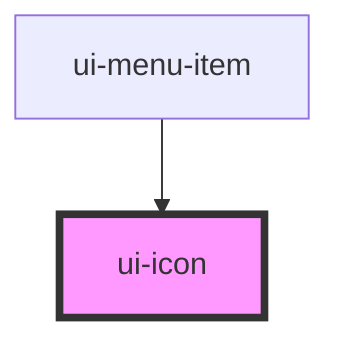

# ui-icon

<!-- Auto Generated Below -->

## Properties

| Property | Attribute | Description             | Type     | Default     |
| -------- | --------- | ----------------------- | -------- | ----------- |
| `name`   | `name`    | Name of the icon to use | `string` | `undefined` |
| `src`    | `src`     | Path to a SVG file      | `string` | `undefined` |

## Dependencies

### Used by

 - [ui-menu-item](../menu/menu-item)

### Graph

----------------------------------------------

*Built with [StencilJS](https://stenciljs.com/)*
