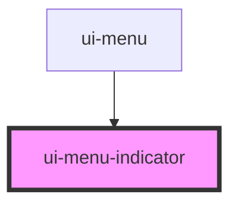

# ui-menu-indicator

<!-- Auto Generated Below -->

## Properties

| Property   | Attribute  | Description                                                         | Type          | Default |
| ---------- | ---------- | ------------------------------------------------------------------- | ------------- | ------- |
| `target`   | --         | The menu item that is highlichted by the indicator                  | `HTMLElement` | `null`  |
| `vertical` | `vertical` | If set to `true` a vertical indicator is displayed on the left side | `boolean`     | `false` |

## CSS Custom Properties

| Name                             | Description                          |
| -------------------------------- | ------------------------------------ |
| `--ui-menu-indicator-color`      | color of the indicator               |
| `--ui-menu-indicator-size`       | width/height of the indicator        |
| `--ui-menu-indicator-transition` | duration and speed of the transition |

## Dependencies

### Used by

 - [ui-menu](..)

### Graph

----------------------------------------------

*Built with [StencilJS](https://stenciljs.com/)*
