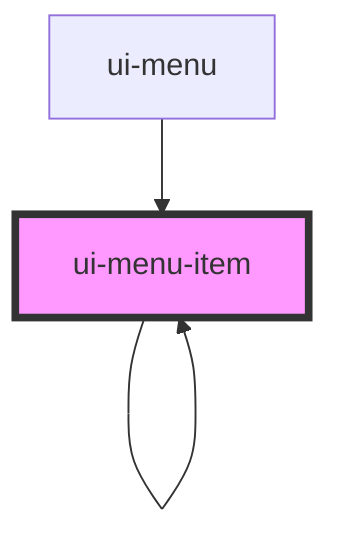

# ui-menu-item

<!-- Auto Generated Below -->

## Properties

| Property       | Attribute       | Description                                                               | Type                    | Default      |
| -------------- | --------------- | ------------------------------------------------------------------------- | ----------------------- | ------------ |
| `disabled`     | `disabled`      | Flag that indicates if the menu item is disabled                          | `boolean`               | `false`      |
| `expanded`     | `expanded`      | If the item has nested items                                              | `boolean`               | `false`      |
| `icon`         | `icon`          | Name of the icon that should be rendered instead of or before the label   | `string`                | `undefined`  |
| `iconOnly`     | `icon-only`     | Flag that indicates that the menu-item only renders an icon without label | `boolean`               | `undefined`  |
| `items`        | --              | Data provider for the menu child elements                                 | `IMenuItem[]`           | `null`       |
| `label`        | `label`         | Label text use as aria-label attribute and slot fallback                  | `string`                | `undefined`  |
| `level`        | `level`         | The level in a nested menu                                                | `number`                | `0`          |
| `name`         | `name`          | Name that must be unique in the menu scope identifies the menu-item       | `string`                | `undefined`  |
| `parent`       | --              | The parent item element in a nested menu                                  | `HTMLUiMenuItemElement` | `null`       |
| `role`         | `role`          | The `role` attribute of the element                                       | `"menuitem" \| "tab"`   | `"menuitem"` |
| `selected`     | `selected`      | Flag that indicates if the menu item is currently selected or not         | `boolean`               | `false`      |
| `trailingIcon` | `trailing-icon` | Name of the icon that should be rendered after the label                  | `string`                | `undefined`  |

## Slots

| Slot          | Description                    |
| ------------- | ------------------------------ |
| `"(default)"` | Custom menu item label content |

## CSS Custom Properties

| Name                            | Description                                   |
| ------------------------------- | --------------------------------------------- |
| `--ui-icon-size`                | used for the label min-height                 |
| `--ui-menu-bg-color-hover`      | background color when hovered                 |
| `--ui-menu-color`               | default text and icon color                   |
| `--ui-menu-color-active`        | text and icon color when the item is active   |
| `--ui-menu-color-disabled`      | text and icon color when the item is disabled |
| `--ui-menu-color-focus`         | text and icon color when the item has focus   |
| `--ui-menu-color-selected`      | text and icon color when the item is selected |
| `--ui-menu-item-border-radius`  | border radius of the menu item                |
| `--ui-menu-item-border-width`   | outline thickness                             |
| `--ui-menu-outline-color`       | outline color                                 |
| `--ui-menu-outline-color-focus` | outline color when the item has focus         |

## Dependencies

### Used by

 - [ui-menu](..)
 - [ui-menu-item](.)

### Depends on

- [ui-menu-item](.)
- [ui-icon](../../icon)

### Graph

----------------------------------------------

*Built with [StencilJS](https://stenciljs.com/)*
