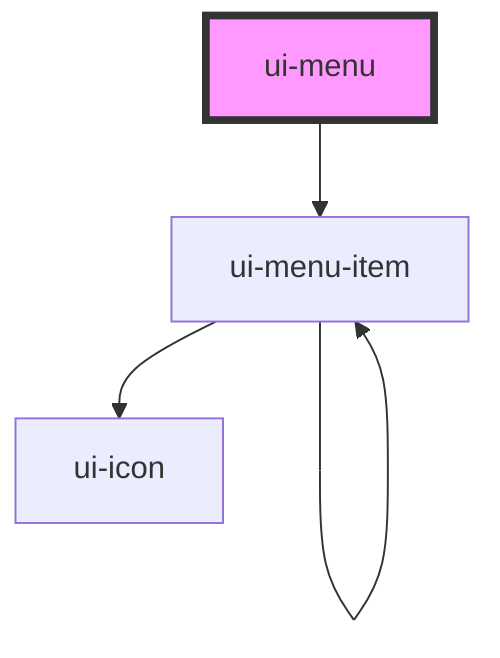

# ui-menu

<!-- Auto Generated Below -->

## Properties

| Property      | Attribute  | Description                                                    | Type                               | Default     |
| ------------- | ---------- | -------------------------------------------------------------- | ---------------------------------- | ----------- |
| `current`     | `current`  | Name of the currently selected menu item                       | `string`                           | `undefined` |
| `items`       | --         | Data provider for the menu structure                           | `IMenuItem[]`                      | `null`      |
| `kind`        | `kind`     | Style variant of the menu                                      | `"primary" \| "secondary"`         | `"primary"` |
| `name`        | `name`     | Name that identifies the menu                                  | `string`                           | `undefined` |
| `role`        | `role`     | The `role` attribute of the menu                               | `"menu" \| "menubar" \| "tablist"` | `"menubar"` |
| `rootElement` | --         | Name that identifies the menu                                  | `HTMLElement`                      | `undefined` |
| `toggle`      | `toggle`   | If set to `true` the menu items can be deselected when clicked | `boolean`                          | `undefined` |
| `vertical`    | `vertical` | If set to `true` the menu items are arranged vertically        | `boolean`                          | `false`     |

## Events

| Event          | Description                                        | Type                                              |
| -------------- | -------------------------------------------------- | ------------------------------------------------- |
| `uiMenuChange` | Emitted when a menu item is selected or deselected | `CustomEvent<{ name: string; current: string; }>` |

## Slots

| Slot          | Description                                    |
| ------------- | ---------------------------------------------- |
| `"(default)"` | the `menu-item` elements belonging to the menu |

## CSS Custom Properties

| Name                           | Description                              |
| ------------------------------ | ---------------------------------------- |
| `--ui-menu-bg-color`           | default background color                 |
| `--ui-menu-bg-color-secondary` | background color for variant `secondary` |
| `--ui-menu-text-color`         | default text and icon color              |

## Dependencies

### Depends on

- [ui-menu-item](menu-item)

### Graph

----------------------------------------------

*Built with [StencilJS](https://stenciljs.com/)*
